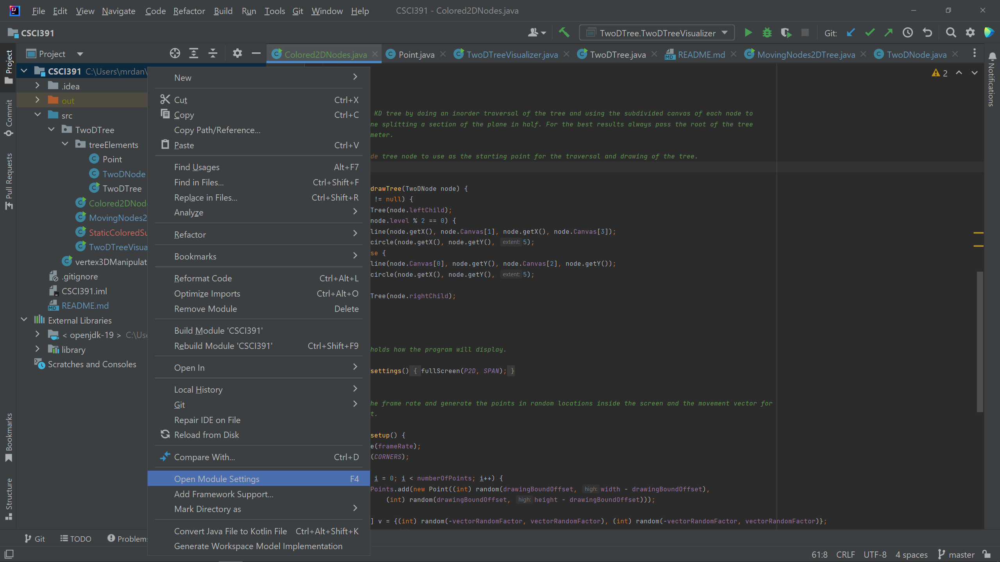
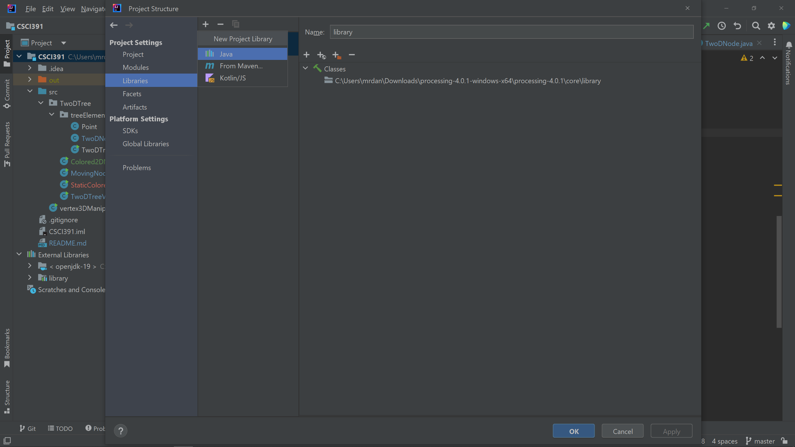

# CSCI 395: KD Tree Visualization Research
The following repo was part of an academic project to explore K-D Trees inside Processing.
The idea was inspired by the following lecture by Raven Kwok [link](https://www.youtube.com/watch?v=MJULayyg4sU)

You can see the visual demo results of the project here [YouTube](https://youtube.com/playlist?list=PL9aybCwX1uNQvNmc_LVKgL_K_dA3MD0St)

The code here was worked on in IntelliJ IDEA, in case you want to view and play with the code, just clone this repo and
make sure the project structure has the Processing library added to the project.

